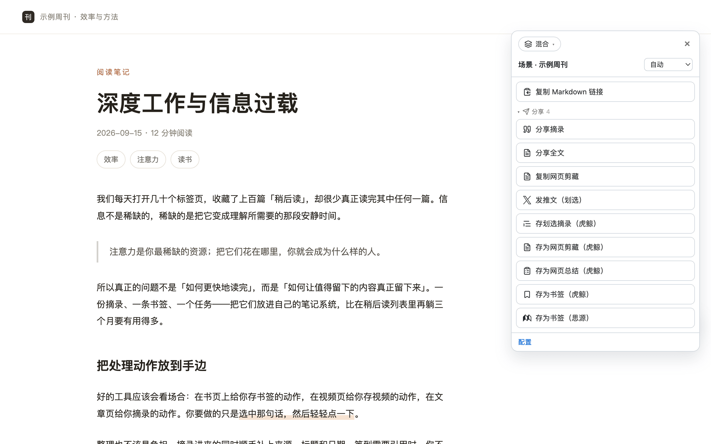
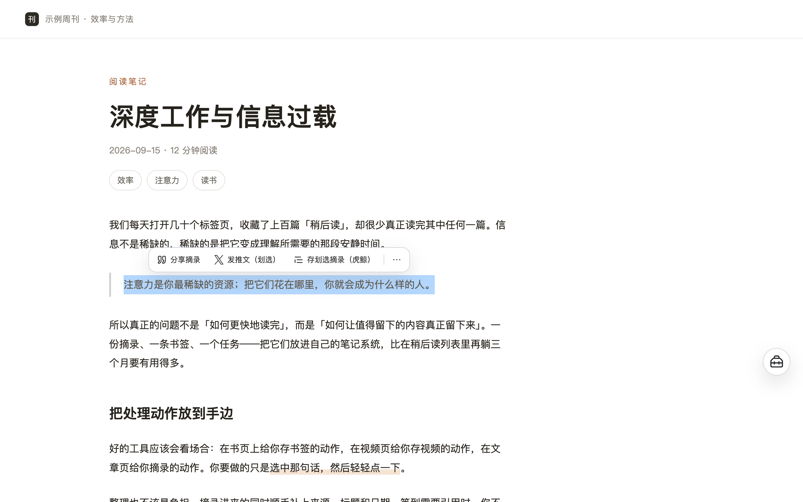
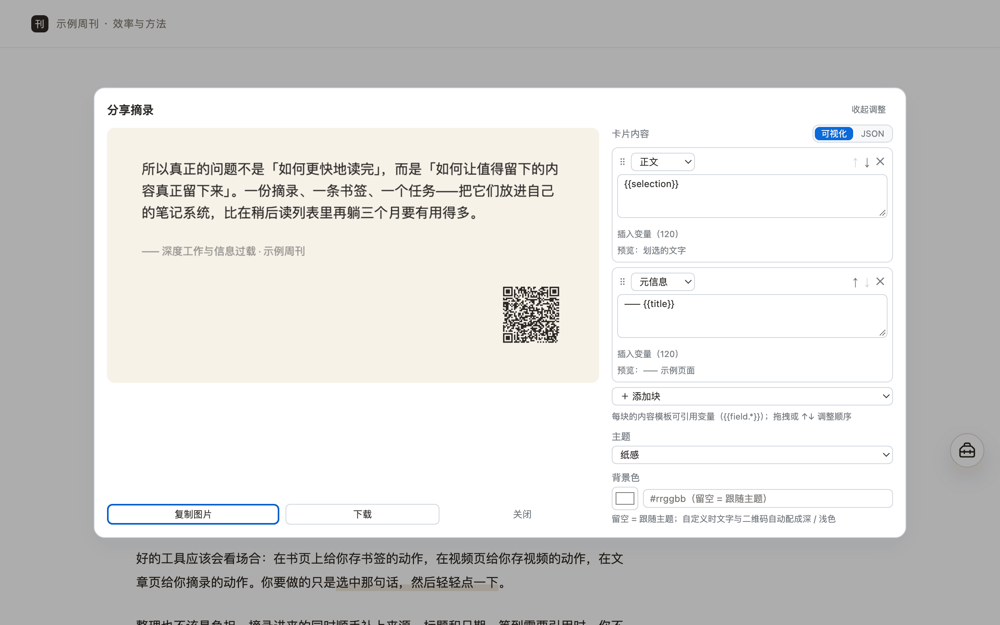
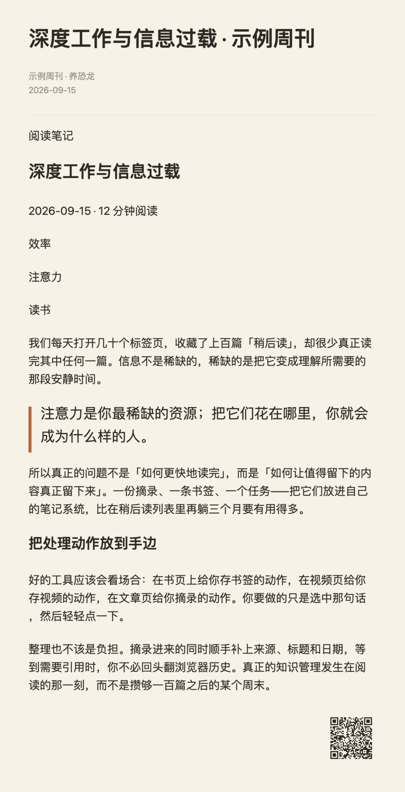
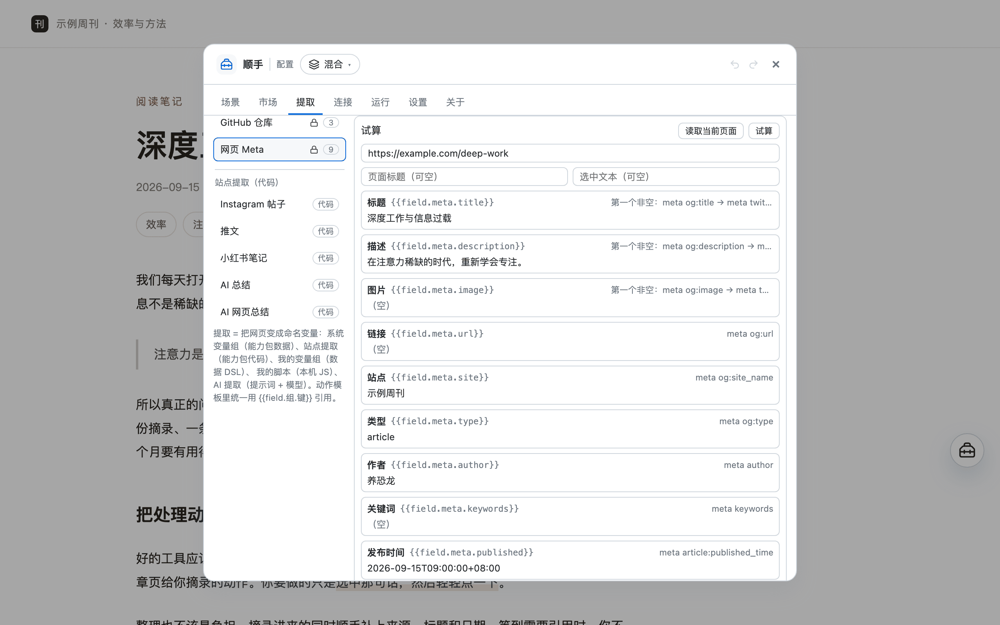
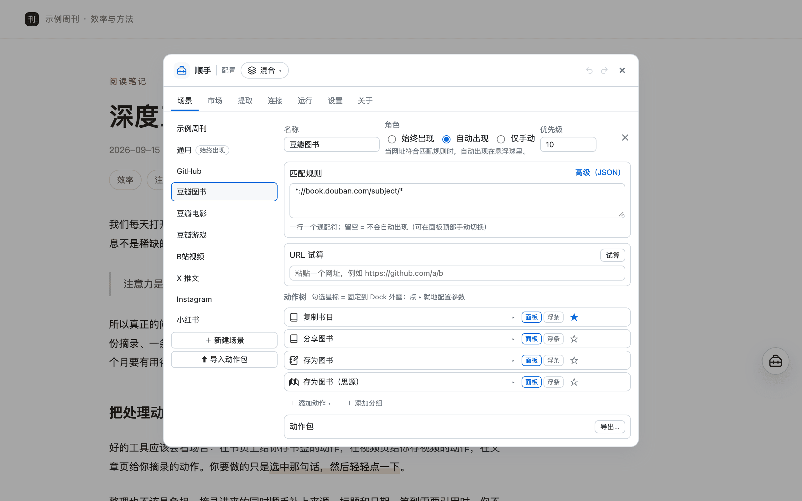

<!--
  English translation of README.md (甲档第二步 / English docs step 2).
  Structure, links and screenshots mirror the Chinese version one-to-one.

  Reviewer decisions (2026-09-18):
  - Patron list is NOT duplicated here: `pnpm gen:patrons` only writes README.md's marker block,
    so this file links to the Chinese README instead (avoids staleness).
  - The shipped UI is Chinese-first: a short note in the intro states that, and quoted UI labels
    are translations of the Chinese UI.
  - Author pen name 养恐龙 is kept in Chinese (brand.ts has no English form).
  - Path examples use `Shunshou/...` (brand folder) as an illustration.
-->

  

<h1 align="center">Shunshou · Context-Aware Web Toolbox</h1>

<a href="./README.md">中文</a> · English

Whatever you're doing on the web, done right at hand.

  
  
  

  

Shunshou is a browser extension (Chrome / Edge) — and also a **userscript** that installs on desktop and mobile: it notices which page you have open and quietly swaps in the right actions — save books, movies, and games from Douban, collect videos, comments, and subtitles from Bilibili, turn X / Xiaohongshu / Instagram posts into cards in one click, send your selection to Orca Note / SiYuan. When you want to share something, a quote or a long article, a whole page of text and images is ready in a moment. Things you do often can even be set to "auto-run" — open the matching page and they run for you.

- **No account, no server**: config and secrets stay on your machine; content is only sent to the notes / model services you configure yourself
- **Context-aware**: built-in scenes for GitHub, Douban, Bilibili, X, Xiaohongshu, Instagram and more; every other page gets generic actions like bookmark, excerpt, full-page clip, and share
- **Clean clips**: built-in site rules (Douban books/movies, GitHub, Bilibili, WeChat Official Accounts, SSPAI) are accurate out of the box, and other pages use the article engine to detect the main content automatically. If it's off, use "pick content" — click containers (you can select several), and it takes effect immediately; you can also save it as a site rule
- **Built to keep**: clips, share cards, and articles can all be **saved as local files** (Markdown / text / images); paths support variables and subfolders, e.g. `Shunshou/{{date:YYYY-MM-DD}}/{{title}}.md`, ready to drop straight into your Obsidian / SiYuan vault; with Obsidian installed you can also **save straight into your vault in one click** (an `obsidian://` deep link, with a configurable folder inside the vault)
- **Selection-first**: select some text and quick actions like "Excerpt / Post to X / Save to notes" appear right above the selection; with AI connected you also get "Translate" — the translation shows in a floating bubble beside the selection (draggable, copyable; decide whether to share after reading)
- **Chainable**: actions can carry "then do" steps — one click runs the whole chain (save to Orca, then write to SiYuan; save, then copy the link…); steps can also be set to "wait for my confirmation", so they don't run automatically and wait for you on the result surface
- **Hands-on**: actions can be set to "auto-run" or "suggest only" — run for you when the matching page opens, or just give you a nudge (off by default, enabled per action, with delay, cooldown, and ask-before-running options); chains can also click buttons, fill inputs, wait for elements, and capture page elements as images
- **No code required**: actions, matching rules, extraction fields, and content templates are all adjusted visually in the Studio, and mistakes can be undone in one click
- **Extensible**: optionally connect your own AI model; you can also install actions others have made from the "Action Market"

*Note: the extension's interface is currently in Chinese.*

## Installation

**Browser extension (recommended on desktop):**

**Edge Add-ons (recommended)**: [Shunshou · Context-Aware Web Toolbox](https://microsoftedge.microsoft.com/addons/detail/elhiacffkdkpkcegafabljaldcoimich) installs in one click and updates automatically.

**Or load it manually** (the Chrome Web Store listing is under review — use this for now; it also works in other Chromium browsers):

1. Download the latest `shunshou-extension-*.zip` from [Releases](https://github.com/hqweay/shunshou/releases/latest)
2. Unzip it to any folder (don't double-click it to run directly)
3. Open `chrome://extensions` → turn on "Developer mode" in the top right → "Load unpacked" → select the unzipped folder

> **Live on Edge Add-ons**; **the Chrome Web Store listing is under review**, and a store link will follow.

**Userscript (for phones, or when you'd rather not install an extension):**

Install a userscript manager first, then open the install link (the manager checks for updates automatically):

- **Desktop**: install [Tampermonkey](https://www.tampermonkey.net/) or [Violentmonkey](https://violentmonkey.github.io/) in Chrome / Edge / Firefox
- **Android**: install Tampermonkey / Violentmonkey in [Firefox for Android](https://www.mozilla.org/firefox/browsers/mobile/android/) (or another extension-capable browser such as Kiwi)
- **iOS / iPadOS**: install [Userscripts](https://github.com/quoid/userscripts) (free on the App Store) or Tampermonkey in Safari

Install link (or create a new script in the manager and paste the contents):

**https://github.com/hqweay/shunshou/releases/latest/download/shunshou.user.js**

> **On mobile**: the injected UI is adapted to narrow screens and touch — the floating orb sits in the bottom-right; tap it to open the actions panel. Actions pinned beside the orb are always visible on touch devices (phones have no hover), and "In-page config" fills the screen.
> A few desktop-only capabilities **degrade explicitly** and say so (browsing footprint covers only the current tab, saved-file subfolders are flattened, cross-tab stats are unavailable); the features themselves are still there.

## Three-minute setup

1. **Open any page**: a floating orb appears in the bottom-right; on GitHub / Douban / Bilibili / X / Xiaohongshu and other pages it switches to the matching scene automatically
2. **Select some text**: a small capsule floats above the selection — click "Share excerpt / Post to X / Save excerpt"; you can also use actions from the orb.
   Select a sentence in a foreign language and click "**Translate**" — the translation appears right next to the selection (without leaving the page; the bubble is draggable)
3. **Open a good article**: click "Share full text" to lay the whole article and its images out as a card (very long ones paginate automatically, nothing gets cut off);
   click "Copy page clip" to copy it as Markdown (with image links) that pastes straight into Obsidian / Notion / SiYuan; to save it as a file directly, click "**Save Markdown locally**" — it lands in `Downloads/Shunshou/date/title.md`; with Obsidian installed, click "**Save to Obsidian**" to write it straight into your vault
4. **Configure**: the gear "**In-page config**" at the top of the orb panel opens right in the page — try fields / clips against the current page and pick article containers;
   clicking the extension icon in the browser toolbar → "Open Studio" gives you a standalone tab

## Features

### Context-aware: site scenes

| Site | What Shunshou can do |
|---|---|
| GitHub | Copy `owner/repo`, generate a repository share card |
| X (Twitter) | Tweet text + images: copy the text, generate a share card, prefill a new post |
| Xiaohongshu | Note title / text / **all images** (carousel auto-completed) and like-save counts: copy the text, generate a share card |
| Instagram | Post images auto-completed into an "image wall": copy the text, generate a share card (with author / date / likes) |
| Douban (books / movies / games) | 17 / 20 / 11 fields extracted automatically (movies and TV share the same set: format / episode count / synopsis, etc.): copy the info, share card, write to Orca / SiYuan |
| Bilibili videos | Video info + comments (including replies) + **subtitles** (CC / AI-generated, requires a Bilibili login): copy, generate a share card, save as a video note, save subtitles to your notes or let **AI summarize the subtitles** (summary + key points) |
| Any page | Copy Markdown link / excerpt, save as bookmark or task, full-page clip, **save Markdown locally**, **save to Obsidian**, AI summary, **selection translation**, share card, post to X; click / fill / wait, element screenshots (multiple blocks / stitched long image) |

The orb can be dragged to snap to the edge, hovered to expand persistent actions, and used to switch scenes manually at the top of the panel. It can also switch **modes** — modes are organized by purpose (out of the box: Daily / Work / Study / Marketing — Daily needs zero setup, Work and Study write to notes, Marketing makes cards and posts), and a mode is a whole set of scenes, so switching one mode swaps your entire workflow instead of editing actions one by one. Backends such as Orca / SiYuan / AI models are global **connections**: configure one and its actions show up automatically. Actions can be grouped (there are "Share" and "AI" groups out of the box), and collapsed state is remembered.
Actions that aren't set up yet (say, no notes connection chosen) are tucked into the "Unconfigured" section at the bottom of the panel and appear automatically once configured.

### Clean clips: content scope and site rules

- **Accurate by default**: built-in site rules cover Douban books/movies, GitHub, Bilibili, WeChat Official Accounts, and SSPAI; other pages use the article engine (Readability)
  to detect the main content automatically. Hidden content (including ads hidden by ad blockers) doesn't make it into the clip
- **Pick when it's off**: In-page config → "Site rules" → "Pick content" → click containers on the page (**multi-select supported**, press Enter to finish; a single paragraph or short quote counts)
  → choose the scope (whole site / this kind of page) → save and it takes effect; "Diagnose this page" tells you the source, which rule matched, and how many characters each block clipped;
  deleting a rule falls back to the system default, and built-in rules can be disabled individually too
- **One scope per action**: the action's expanded panel has "**Content scope**" to set it just for that action — pick containers (multiple blocks merge),
  "pick at run time", or reference a site rule as a base and override only the parts you want (including remove / keep cleanup and the image threshold).
  That's why "Save article" and "Save comments" don't step on each other
- **Article line breaks** (per action, in the expanded panel): treat single line breaks as paragraphs / 1 or 2 line breaks between paragraphs (SiYuan semantics: 1 = line break in the same block, 2 = new block) /
  collapse consecutive blank lines — only affects article-type variables, Markdown clip structure is untouched; the old global setting on the Settings page is written into each action once after upgrading

### Selection-first

Select text on a page and a small capsule appears above the selection — it lists only the actions that **actually use the selection** (usually just two or three; the rest go into `⋯`):

  

- Clicking the capsule won't clear your selection; scrolling, clicking blank space, or pressing `Esc` dismisses it; if you don't like it you can turn it off on the Settings page and keep using the orb as usual
- **Selection translation (AI)**: select a sentence → click "Translate" → a small bubble appears next to the selection **showing the translation in place** (without leaving the page or switching tabs);
  the bubble can be **dragged** out of the way of the text it covers, and copied in one click. When you're happy with the translation, the bottom of the bubble also offers "Share card / Post to X" —
  **decide after you've read it**; nothing is posted for you automatically (requires an AI connection set up in the Studio)
- To pin where an action shows up: each action row in the Studio has a persistent **"Panel · Capsule · ★" visibility cluster** (show in the orb panel / show in the selection capsule / pin next to the orb)

### Sharing

- **Share card**: select → a clean card; delivery is handled by "then do" steps — the image stays in the result dialog to copy / download on demand, and you can add
  "Save image file" in the action. Four themes (paper / ink / brand / pure white),
  four sizes (long / 4:5 / 3:4 / 1:1), content blocks can be added, removed, and reordered, and the bottom-right carries a QR code to the source page by default
- **Preview as a workbench**: after rendering, a preview opens — "Adjust" lets you switch theme / background color / font directly and edit the card content;
  "Share full text" also lets you edit this run's article in place (affects this run only, not saved to config), and "Save to action" when you're happy; if the image is too long to read, click it to "View full size"
- **Share full text / page clip**: the whole article and its images are laid out **in reading order** as a card, and very long ones split into several images with nothing cut off
  (copy them one by one / download all from the result dialog — no automatic clipboard grab; "Copy" just copies, it won't stuff files onto your disk);
  it can also be copied as Markdown in one click (with image links, ready to paste into Obsidian / Notion / SiYuan)
- **Save as local files**: full-page clips / share cards / text can all be saved as local files (Markdown / text / images),
  and paths support variables and subfolders — e.g. `Shunshou/{{date:YYYY-MM-DD}}/{{title}}.md`, ready to drop straight into your Obsidian / SiYuan vault;
  names are auto-numbered on collision, and once the extension has the "Manage downloads" permission you can also choose to overwrite. Files are only written to your own Downloads folder — your existing download history is never read or listed
- **Save to Obsidian**: with Obsidian installed, write a page clip straight into your vault in one click — via an `obsidian://` deep link handed to Obsidian, with no server in between;
  the path inside the vault supports subfolders (e.g. `Shunshou/{{date:YYYY-MM-DD}}/{{title}}`), collisions can append or overwrite, and by default the note doesn't pop open.
  Set a vault name once and you're set (leave it empty to use the current vault)
- **Share to social platforms**: X / Weibo / Bluesky / Telegram / Mastodon / Reddit — opens the platform's official share dialog with the content prefilled;
  no account or credentials needed, and you confirm in the editor before posting

  

  

### Save to notes (optional)

- **Orca Note**: MCP endpoint + Token + repository ID; tags and properties are created / filled in automatically per the scheme (types are coerced automatically)
  - Bookmark / excerpt / task: the content shape is just a template, change it however you like
  - **Full-page clip / web summary**: the page title is the parent block (filed under the "Bookmark" tag), and the article (or AI summary) becomes its child block;
    page info (links, etc.) is stored as properties per the "Bookmark" tag scheme; content hidden on the page (including ads hidden by ad blockers) doesn't make it into the clip
- **SiYuan**: kernel address (default `http://127.0.0.1:6806`) + API Token, two targets:
  - **Database (attribute view)**: write a row; the column scheme is edited visually and missing columns are created automatically; **duplicate check before saving** — when a row with the same name already exists,
    a dialog asks "Update / Skip / Create new" (Skip by default, protecting cells you edited by hand); **image columns are localized automatically** — Douban covers and the like are downloaded and
    stored in the SiYuan asset library, so thumbnails show up in the database instead of broken images (you can switch to "Keep original link")
  - **Document / daily note**: pick a notebook first; leaving "Target document" empty means **today's daily note** (located automatically, created if missing),
    or save to a specific document (created automatically if not found); content and insertion position (end / beginning) are configurable
  - **Document database**: create the content as a new SiYuan document and **bind** it into the chosen database — it can follow the database's "item template",
    or use a custom save path (e.g. `/Collection/{{dateText}}/{{title}}`); article images are uploaded to the SiYuan asset library by default.
    **Works out of the box**, plus an **AI summary** variant (first use AI to summarize the whole article into structured Chinese, then save it; requires an AI connection)

### Then do (action chains)

An action can carry a series of **follow-up steps**: after the main step succeeds they run in order, and any failure stops the chain; page info is extracted once and shared by the whole chain.

- Example: **Save to both libraries** — save an Orca bookmark, then write a row to a SiYuan database (one click, both libraries populated)
- Example: **Save and share** — save a bookmark, then copy "《Title》 Link" to the clipboard
- **"Wait for my confirmation" = a "Next step" on the result surface**: some steps shouldn't run automatically — an AI translation, for instance, you want to glance at before deciding whether to save it to
  Anki / share. Mark a step "wait for my confirmation" and it won't run with the chain; instead it shows up on the **result surface** (the selection-translation bubble, the result dialog) and runs only when you click it.
  The built-in "Translate" ships with two: share card (original + translation) / post to X (translation + link)
- Add steps by expanding an action on the Studio's "Scenes" page; the two examples above are ready-made action packs: Studio → "**Market**" → fetch → install

### Automation (auto-run · page actions)

Every action has a "trigger" — manual / **auto-run** / **suggest only**:

- **Auto-run**: runs for you when a matching page opens, no click needed. It's **off** by default, enabled per action, and you can set a
  **delay** (wait for rendering / lazy loading), a **cooldown** (minimum interval), a dedupe scope (every visit / once per document), and
  **ask before running** (recommended for side-effecting actions like writing to notes). Nothing is set to auto-run out of the box;
  action packs from the "Action Market" that ship with auto-run are **off after installation too** — whether to turn it on is always your call
- **Suggest only**: doesn't run, just shows a small dot on the orb to remind you "there's something you could do here"
- **Silent sites**: sites on the "Silent sites" list never trigger automatically (you can still open the orb manually). Studio → "**Run → Automation**"
  lists all enabled auto-runs in one place, lets you tune parameters in place, shows recent runs, and holds the silent list too

**A few things you can do**:

- **See it, log it**: auto-run "Save as movie / book / game (SiYuan)" on Douban book / movie / game pages — browse and it's in your library,
  with no clicks at all; turn on "ask before running" if you'd rather confirm before writing
- **Expand, then clip**: chain "**Click** 'Expand full text' → **Wait** for the element → **Copy page clip**" in one action —
  works for collapsed comments and lazily loaded long articles
- **Select and search**: pick the site's search box and have "**Fill input**" use `{{selection}}` — select a phrase and click once to fill it in
  (React-controlled search boxes work too)
- **Auto-archive**: open a report / dashboard page and automatically **capture a chosen area as PNG** and save it; you can also capture after a "click open"
- **Stitch a long image**: pick **several blocks** at once to screenshot them one by one, or **stitch them vertically into one long image** — a whole timeline's posts, several tables on a page, anything can go together
- **Notify me after it saves**: add a "Send notification" step at the end of the chain (Studio "New from capability"), so it tells you the result once it's done

**The page-action trio** (click / fill / wait, building blocks in a chain): you don't write selectors by hand — use "**Pick**" next to the parameter and click on the page.
All three are **synthetic events and best-effort**: rich text editors (Slate / ProseMirror types) and file uploads are not promised, and sites with bot protection may not respond.

**Element screenshots**: capture any element on the page (table / chart / card) as PNG, then copy or save it; the selector is picked the same way —
**multi-select several blocks at once** to export them one by one, or **stitch them vertically into one long image**.

### AI extraction (optional)

Connect your own OpenAI-compatible model (DeepSeek / OpenRouter / SiliconFlow / local Ollama all work):

- **The prompt is the config**: hand `{{content}}` (selection first, whole page if nothing is selected), `{{page.clip}}` (full-page clip) to the model,
  and it produces **custom fields** like summary / tweet copy / keywords; the fields are used in any action template just like ordinary variables
- Ready-to-use actions out of the box: "Summarize and post to X" (selection → AI summary → open X prefilled), "Copy AI summary", "AI summary card",
  **"Selection translation"** (selection → show the translation in an inline bubble, then share card / post to X), and "Save as web summary (Orca)" which saves a full-page AI summary to Orca;
  with only one AI connection it's bound automatically
- There's a progress indicator before the call, and results are cached for the session (no double billing); actions without a connection are collected in the "Unconfigured" section; content is only ever sent to **the endpoint you configured yourself**

### Action Market

- Subscribe to the official catalog on the Studio's "Market" page: **fetch → browse by tag / search → install**; utility actions are merged into the "always visible" layer automatically,
  and sites are packaged as new scenes; dependencies and conflicts are reported
- Installed packs can be "Check for updates" and "Uninstall" (variable groups / prompts that came with the pack are only cleaned up when nothing references them)
- Action packs are **pure data** (actions / extraction rules / prompts) with no code or secrets; you can also export scenes you've configured as a
  `.action-pack.json` to share with friends

### Studio and extraction

The Studio has eight pages — "Scenes / Market / Extract / Connections / Run / Settings / Thanks / About"; all changes take effect immediately, with **Ctrl/⌘+Z to undo and Ctrl/⌘+Shift+Z to redo** (50 steps per session).

The "Extract" page turns "web page → variables" into visual configuration: a field source can be a selector / "label:value" / meta / JSON-LD / URL regex / selection /
template / try in order (fallback chain), and you can add transform chains (trim / replace / regex extract / truncate / split / default value);
there are 5 **system variable groups** out of the box (GitHub, web Meta, Douban books/movies/games) — click "Override" to change them; by default an override applies only to the current site and other sites fall back to the system version automatically.
There are also built-in placeholders like `{{page.text}}` / `{{page.clip}}` / `{{page.table}}` / `{{selection.context}}` / `{{clipboard}}` / `{{pick.*}}`, read lazily by reference — untouched if unused.
"Try" shows each field's value instantly:

  

  

- If you write JS, you can write local scripts under "My scripts" (input `{ url, title, selection, document }`, may return a Promise) —
  stored only on your machine, **not in the config and not included in export / sharing**; on first use in the extension, turn on "Allow User Scripts" on the extension's details page
- The "Run" page has four tabs: **Action usage** (last-7-days trend, 12-week heatmap, most-used actions, which actions you've never used),
  **Browsing footprint** (local dwell time / site ranking; on by default, can be turned off or cleared at any time),
  **Automation** (the list of actions with auto-trigger enabled + tune "suggest only / delay / cooldown / ask before running" in place, plus recent auto-runs;
  "Silent sites" is here too — silent sites skip all auto triggers first), **Issues** (config health check + recent run errors)
- The "About" page lets you manually **check for updates** (it only requests public version info from GitHub when you click)

## Updating

**Extension**: download the latest zip and go through "Load unpacked" again (your config is kept).
**Userscript**: your userscript manager checks for updates automatically; usually nothing to do.

You can also click "**Check for updates**" on the Studio's "**About**" page to see if there's a new version; new default scenes / actions in a new version are delivered
incrementally the next time you open it — what you changed stays, and what you deleted doesn't come back.

## Privacy

Shunshou doesn't collect or upload any data; there's no account and no server. Config and secrets stay on your machine,
and writing to notes / calling models talks directly to the services you configure. "Save locally" only writes the current file to your own Downloads folder and never reads your existing download history. See the [Privacy Policy](PRIVACY.en.md) for details.

## Thanks

Shunshou is free, ad-free, and account-free. Thanks to everyone who has put their stamp on it — the extension's "Thanks" page shows the same wall of stamps. The live list lives in the [Chinese README](./README.md).

## Feedback

- [Issues](https://github.com/hqweay/shunshou/issues): problems, suggestions, or a new site you'd like
- Author: 养恐龙 · [Blog](https://leay.net/)

---

Shunshou · Context-Aware Web Toolbox · Local-first

